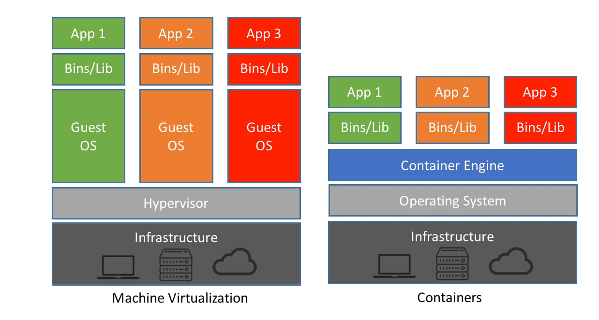

# Virtualization and Containers

## Introduction

Containerization evolved as a solution to the limitations of traditional virtualization. Before containers became popular, applications were deployed using **Virtual Machines (VMs)**. However, virtual machines consumed significant system resources and were slower to start.

To overcome these limitations, **container technology** was introduced.

---

# 1. Origin of Containers

The concept of containerization originated from **process isolation techniques** in operating systems.

Earlier, developers faced a common issue:

> "It works on my machine but not on another system."

This problem occurred because different systems had different environments, dependencies, and configurations.

To solve this issue, engineers introduced isolation technologies.

### Historical Milestones

| Year | Technology             | Description                         |
| ---- | ---------------------- | ----------------------------------- |
| 1979 | chroot (Unix)          | Process runs in isolated filesystem |
| 2000 | FreeBSD Jails          | System level isolation              |
| 2006 | Solaris Containers     | Resource control and isolation      |
| 2008 | Linux Containers (LXC) | Linux kernel based containers       |
| 2013 | Docker                 | Made containers simple and portable |

Docker simplified container usage and made containerization a core component of **DevOps workflows**.

---

# 2. Virtual Machines (Traditional Virtualization)

Before containers, virtualization was achieved using **Virtual Machines (VMs)**.

A virtual machine simulates a complete computer system including:

* CPU
* Memory
* Storage
* Operating System

Each VM runs its own operating system on top of a **hypervisor**.

---

## VM Architecture

```
Application
Libraries
Guest Operating System
----------------------------
Hypervisor
Host Operating System
Hardware
```

### Hypervisor

A **hypervisor** is a software layer that manages multiple virtual machines on a single physical system.

Types of Hypervisors:

| Type                | Example                        |
| ------------------- | ------------------------------ |
| Type 1 (Bare Metal) | VMware ESXi, Hyper-V           |
| Type 2              | VirtualBox, VMware Workstation |

Each VM contains:

* separate OS
* separate kernel
* separate libraries

Because of this, **virtual machines are resource heavy**.

---

## VM Example

Suppose a server needs to run **3 applications**.

VM approach structure:

```
VM1
  Ubuntu OS
  Application A

VM2
  CentOS OS
  Application B

VM3
  Windows OS
  Application C
```

Each VM includes:

* Separate operating system
* Separate kernel
* Separate libraries

Therefore **VMs consume more resources**.

---

# 3. Problems with Virtual Machines

Although virtual machines are powerful, they have some disadvantages.

### 1. High Resource Usage

Each VM requires:

* Separate operating system
* Large memory
* Significant storage

Typical VM size:

**2GB – 20GB**

---

### 2. Slow Startup

Virtual machines require full OS boot.

Startup time:

**1 – 3 minutes**

---

### 3. Infrastructure Cost

Running multiple applications requires multiple VMs, which increases:

* CPU usage
* RAM consumption
* Infrastructure cost

---

# 4. Containers (Modern Solution)

Containers provide **lightweight virtualization**.

A container packages:

* Application
* Dependencies
* Libraries

Unlike virtual machines, containers **share the host operating system kernel**.

---

## Container Architecture

```
Application
Libraries
------------------------
Container Runtime
Host OS Kernel
Hardware
```

Examples of container runtimes:

* Docker
* containerd
* CRI-O

---

## Container Example

Suppose a server runs **5 applications**.

Container approach:

```
Docker Engine
 ├─ Container 1 (App A)
 ├─ Container 2 (App B)
 ├─ Container 3 (App C)
 ├─ Container 4 (App D)
 └─ Container 5 (App E)
```

All containers **share the same OS kernel**.

Therefore containers are:

* lightweight
* fast
* scalable

---

# 5. Container Working Mechanism

Containers use Linux kernel features for isolation and resource management.

### Namespaces

Namespaces provide process isolation.

Types:

* PID Namespace
* Network Namespace
* Mount Namespace
* User Namespace

Example:

Processes running inside one container cannot see processes in another container.

---

### Control Groups (cgroups)

cgroups control system resources.

Examples:

* CPU limits
* Memory limits
* Disk usage limits

Example command:

```
docker run --memory=512m myapp
```

---

### Union File System

Containers use a **layered filesystem**.

Example layers:

* Base OS Layer
* Language Runtime Layer
* Application Layer

This helps reuse images and save storage space.

---

# 6. Virtual Machines vs Containers

| Feature             | Virtual Machine         | Container               |
| ------------------- | ----------------------- | ----------------------- |
| Virtualization Type | Hardware virtualization | OS-level virtualization |
| OS                  | Separate OS per VM      | Shared host OS          |
| Size                | GBs                     | MBs                     |
| Startup Time        | Minutes                 | Seconds                 |
| Performance         | Slower                  | Near native             |
| Resource Usage      | High                    | Low                     |
| Deployment          | Complex                 | Easy                    |

---

# 7. Importance of Containers in DevOps

DevOps focuses on:

* Faster development
* Continuous integration
* Automated deployment
* Consistent environments

Containers solve these problems by packaging applications and dependencies into a portable unit.

### DevOps Pipeline Example

Developer → Docker Image → CI/CD Pipeline → Testing → Production

The same container runs in **development, testing, and production environments**, eliminating configuration problems.

---

# 8. Real World Example

Suppose a developer builds a **Python Flask application**.

Without containers:

Server A → Python 3.9 → Works
Server B → Python 3.7 → Error

With containers:

Docker Image → Python 3.9 + Application → Runs anywhere.

---

# Diagram – Virtualization vs Containers



---

# Short Answer 

Containers originated from operating system process isolation technologies such as chroot, FreeBSD Jails, and Linux Containers (LXC). Traditional virtualization used virtual machines where each VM had its own operating system running on a hypervisor, making them resource intensive. Containers introduced OS-level virtualization where applications run in isolated environments but share the host OS kernel. This makes containers lightweight, faster to start, and more efficient, which is why they are widely used in DevOps and cloud computing.
