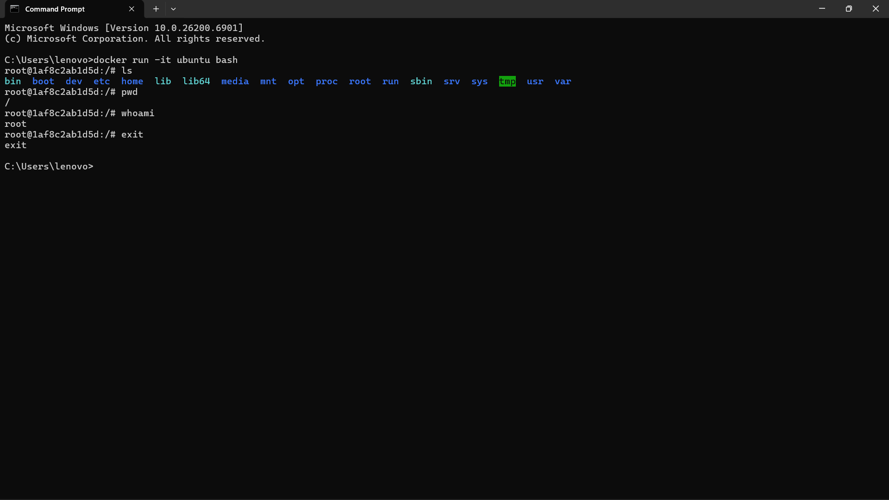
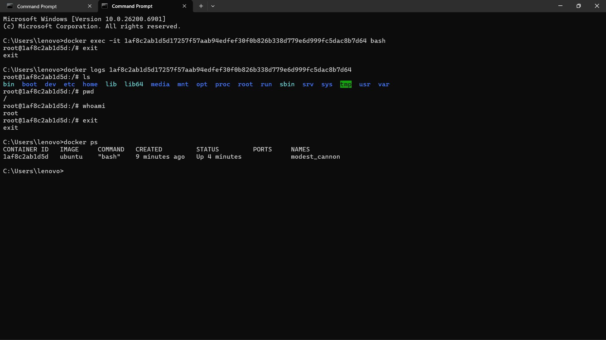
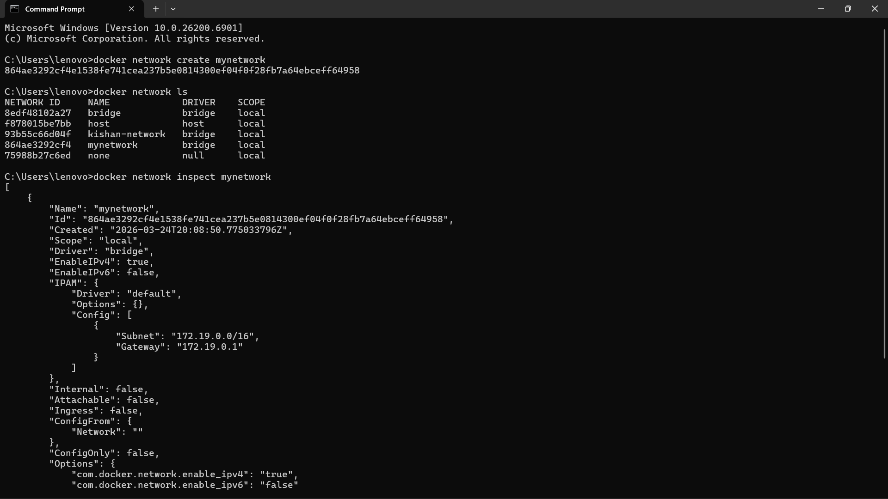
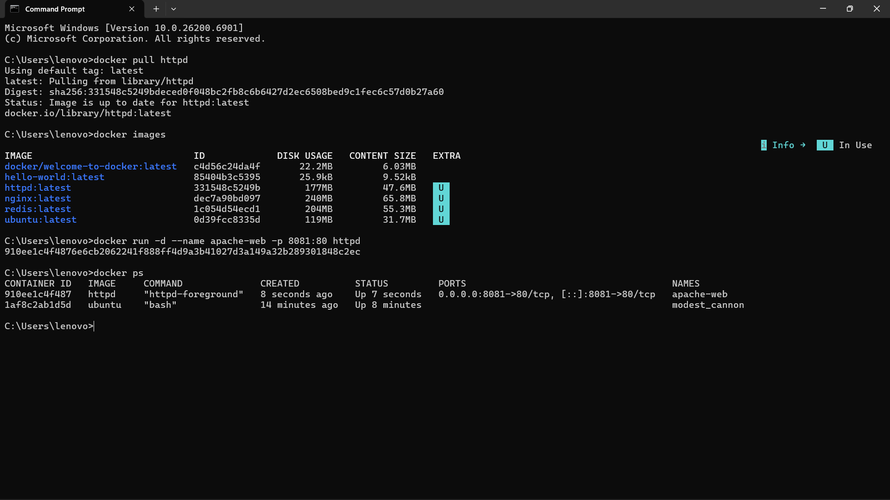
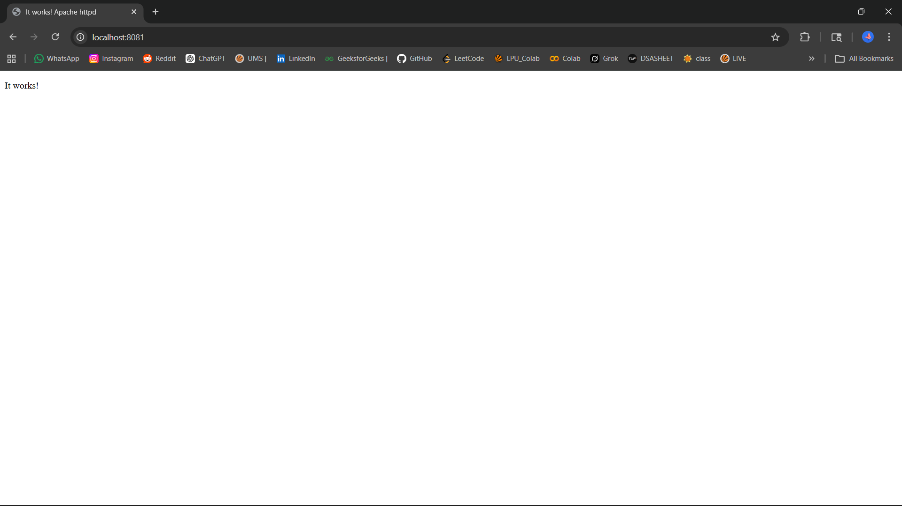

# Unit 1 – Docker Practicals


# Practical 1: Run Ubuntu Container in Interactive Mode

## Problem

A student wants to practice Linux commands inside Docker. Run an Ubuntu container in interactive mode using bash and exit safely after execution. Write the commands used to create and access the container.

---

## Commands Used

### Step 1: Run Ubuntu Container

```
docker run -it ubuntu bash
```

### Step 2: Execute Linux Commands

```
ls
pwd
whoami
```

### Step 3: Exit Container Safely

```
exit
```

---

## Explanation

* `-i` → interactive mode
* `-t` → terminal access
* `bash` → opens shell inside container

---

## Output Screenshot



---

# Practical 2: Troubleshoot Running Container

## Problem

You need to troubleshoot a running container by entering its terminal and checking logs. Write commands to:

* Open bash inside container
* View logs
* Show running processes

---

## Commands Used

### Step 1: Open Bash Inside Container

```
docker exec -it container_id bash
```

---

### Step 2: View Logs

```
docker logs container_id
```

---

### Step 3: Show Running Processes

```
docker ps
```

---

## Explanation

* `docker exec` → run command inside container
* `-it` → interactive terminal
* `logs` → shows container output
* `docker ps` → shows running processes

---

## Output Screenshot



---

# Practical 3: Create and Verify Docker Network

## Problem

Create a custom Docker network named mynetwork and verify its configuration. Write commands to create, list, and inspect the network.

---

## Commands Used

### Step 1: Create Network

```
docker network create mynetwork
```

---

### Step 2: List Networks

```
docker network ls
```

---

### Step 3: Inspect Network

```
docker network inspect mynetwork
```

---

## Explanation

* `create` → creates new network
* `ls` → lists networks
* `inspect` → shows configuration (IP, subnet, containers)

---

## Output Screenshot



---

# Practical 4: Deploy Apache (httpd) Web Server

## Problem

You are a DevOps trainee and need to deploy the Apache HTTP Server (httpd) using Docker for testing a static website. Pull the Apache server image from Docker Hub, create a container named apache-web, and run it in detached mode. Map port 8081 on the host machine to port 80 inside the container so that the website can be accessed through a browser.

Tasks:

* Pull the Apache (httpd) Docker image
* Verify that the image is successfully downloaded
* Run the container with the specified name and port mapping
* Check the list of running containers
* Access the Apache web server using a browser

---

## Commands Used

### Step 1: Pull Apache Image

```
docker pull httpd
```

---

### Step 2: Verify Image Download

```
docker images
```

---

### Step 3: Run Container

```
docker run -d --name apache-web -p 8081:80 httpd
```

---

### Step 4: Check Running Containers

```
docker ps
```

---

### Step 5: Access in Browser

```
http://localhost:8081
```

---

## Explanation

* `docker pull` → downloads image
* `docker images` → verifies image
* `-d` → detached mode
* `--name` → container name
* `-p` → port mapping

---

## Output Screenshot



