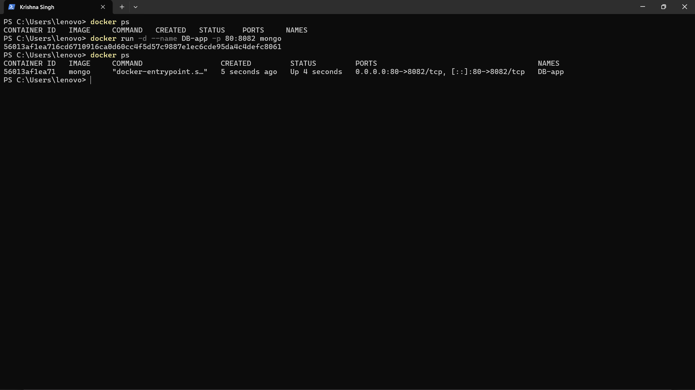
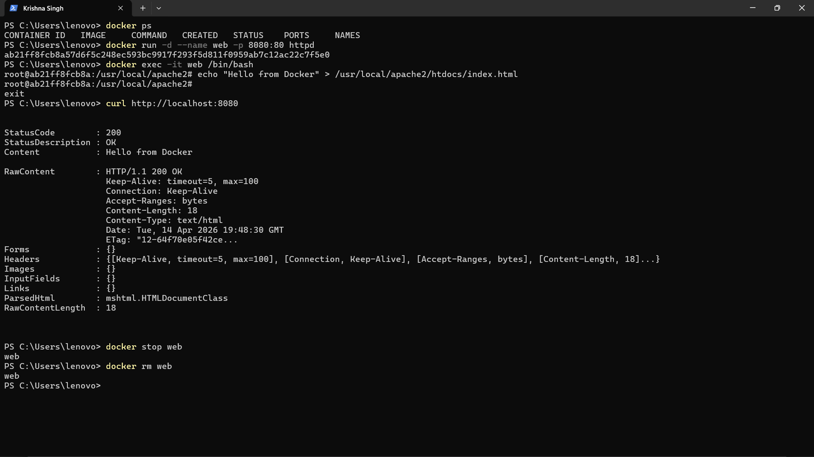
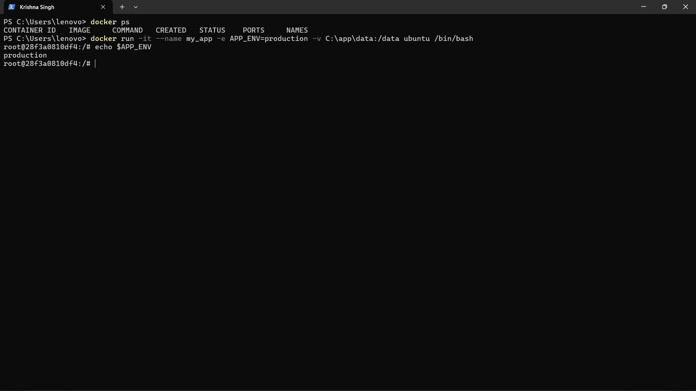
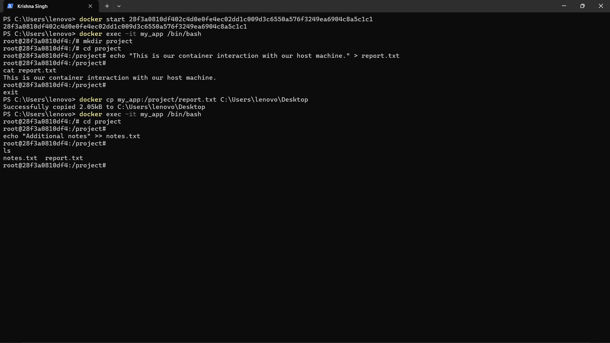
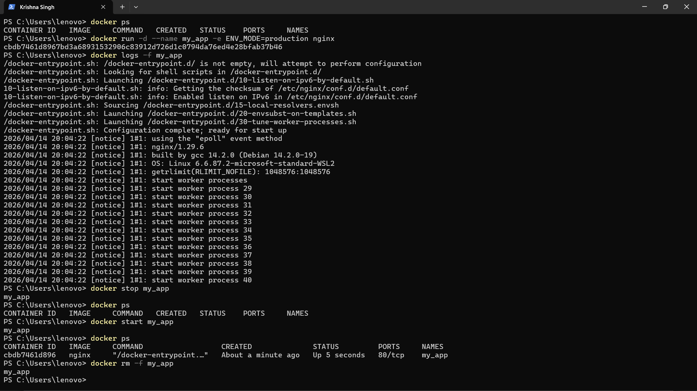

# Unit 2 – Docker Practicals 1 

---

# Practical 1

## Problem

Run a Docker container named "DB-app" based on the "mongodb" image, and expose port 80 on the host to port 8082 on the container.

## Commands

```powershell
docker run -d --name DB-app -p 80:8082 mongo
```

## Screenshot



---

# Practical 2

## Problem

You are a DevOps engineer in a startup company. The development team asks you to quickly deploy a simple web page that displays a message.

Tasks:

* Use the official httpd Docker image
* Run container on port 8080
* Create/update HTML file inside container
* Verify output using command line
* Stop and remove container

## Commands

```powershell
docker run -d --name web -p 8080:80 httpd

docker exec -it web /bin/bash

echo "Hello from Docker" > /usr/local/apache2/htdocs/index.html

curl http://localhost:8080

docker stop web

docker rm web
```

## Screenshot



---

# Practical 3

## Problem

Use docker run with -it, -e, -v, and --name to configure container.

## Commands

```powershell
docker run -it --name my_app -e APP_ENV=production -v C:\app\data:/data ubuntu /bin/bash
```

## Screenshot



---

# Practical 4

## Problem

Inside running container:

* Create /project
* Create report.txt
* Add text
* Verify
* Copy to Desktop
* Create notes.txt
* Append text

## Commands

```powershell
docker exec -it my_app /bin/bash

mkdir project
cd project

echo "This is our container interaction with our host machine." > report.txt

cat report.txt

exit

docker cp my_app:/project/report.txt C:\Users\lenovo\Desktop

docker exec -it my_app /bin/bash

cd project

echo "Additional notes" >> notes.txt

ls
```

## Screenshot



---

# Practical 5

## Problem

1. Start nginx with ENV_MODE=production
2. Check logs of my_app
3. Start and stop web_server

## Commands

```powershell
docker run -d --name my_app -e ENV_MODE=production nginx

docker logs -f my_app

docker start my_app

docker stop my_app
```

## Screenshot


